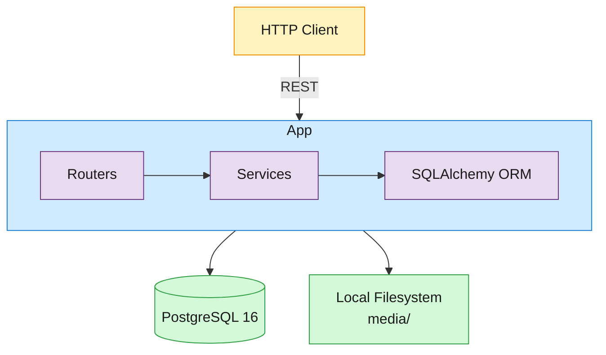

# Instagram MVP — Architecture & Design

A monolithic REST API for photo sharing with push-based feed fan-out and PostgreSQL GIN-backed hashtag search. The broader target architecture scales this to 500M+ DAU with microservices, a Redis timeline cache, S3/CDN media delivery, and a hybrid fan-out model for celebrity accounts — this MVP is the single-service starting point.

## Architecture



The application runs as a single FastAPI process. Routers parse HTTP requests and delegate to services, which hold all business logic. Services interact with PostgreSQL through SQLAlchemy's async engine and write uploaded images to the local filesystem. There is no Redis, no message broker, and no separate search service — PostgreSQL handles both relational data and full-text array search via its GIN index.

### Request flow: post upload

When a user uploads a photo:

1. The router validates the multipart form (image under 10 MB, caption present, valid `X-User-Id` header).
2. The post service extracts hashtags from the caption (`#\w+` regex, lowercased, deduplicated).
3. The image is written to `media/{uuid}.{ext}` on the local filesystem.
4. A `Post` row is inserted into PostgreSQL.
5. All followers of the posting user are queried from the `follows` table.
6. A `FeedEntry` row is inserted for each follower in the same transaction.
7. The router returns `201` with the post metadata and extracted hashtags.

### Request flow: feed read

When a user requests their feed:

1. The feed service queries `feed_entries` joined with `posts` and `users` (for author info).
2. Results are filtered to the requesting user's `user_id` and ordered by `created_at DESC`.
3. Cursor-based pagination uses a `before` timestamp to fetch the next page.
4. Each entry is hydrated with the post's metadata and the author's `user_id`, `username`, and `display_name`.

## Data Model

Six tables, all UUID primary keys, all timestamps in UTC with timezone.

```sql
CREATE TABLE users (
    user_id         UUID PRIMARY KEY DEFAULT gen_random_uuid(),
    username        TEXT NOT NULL UNIQUE,
    display_name    TEXT NOT NULL,
    follower_count  INTEGER NOT NULL DEFAULT 0,   -- denormalized
    following_count INTEGER NOT NULL DEFAULT 0,   -- denormalized
    created_at      TIMESTAMPTZ NOT NULL DEFAULT now()
);

CREATE TABLE posts (
    post_id     UUID PRIMARY KEY DEFAULT gen_random_uuid(),
    user_id     UUID NOT NULL REFERENCES users(user_id),
    caption     TEXT NOT NULL,
    media_url   TEXT NOT NULL,
    media_type  TEXT NOT NULL DEFAULT 'photo' CHECK (media_type = 'photo'),
    hashtags    TEXT[] NOT NULL DEFAULT '{}',       -- GIN-indexed
    like_count  INTEGER NOT NULL DEFAULT 0,         -- denormalized
    created_at  TIMESTAMPTZ NOT NULL DEFAULT now()
);
CREATE INDEX idx_posts_user_created ON posts(user_id, created_at DESC);
CREATE INDEX idx_posts_hashtags ON posts USING GIN(hashtags);

CREATE TABLE follows (
    follower_id UUID NOT NULL REFERENCES users(user_id),
    followed_id UUID NOT NULL REFERENCES users(user_id),
    created_at  TIMESTAMPTZ NOT NULL DEFAULT now(),
    PRIMARY KEY (follower_id, followed_id)
);

CREATE TABLE feed_entries (
    user_id    UUID NOT NULL REFERENCES users(user_id),
    post_id    UUID NOT NULL REFERENCES posts(post_id),
    author_id  UUID NOT NULL REFERENCES users(user_id),
    created_at TIMESTAMPTZ NOT NULL DEFAULT now(),
    PRIMARY KEY (user_id, created_at, post_id)
);
CREATE INDEX idx_feed_user_created ON feed_entries(user_id, created_at DESC);

CREATE TABLE likes (
    post_id    UUID NOT NULL REFERENCES posts(post_id),
    user_id    UUID NOT NULL REFERENCES users(user_id),
    created_at TIMESTAMPTZ NOT NULL DEFAULT now(),
    PRIMARY KEY (post_id, user_id)
);
```

## Key Design Decisions

### Push-based fan-out (feed pre-materialization)

When a post is created, the service inserts a `FeedEntry` row for every follower of the posting user in the same database transaction. A feed read is then a simple indexed scan on `feed_entries` with a JOIN to hydrate post and author data — no graph traversal at read time.

**Decision:** Push to all followers in MVP. The full design introduces a hybrid model: push to followers with ≤10K followers, pull (query on read) for celebrity accounts with larger audiences. This avoids the write amplification of inserting millions of feed entries per celebrity post while keeping the simple push path for the common case.

### PostgreSQL GIN index for hashtag search

Hashtags are stored in a `TEXT[]` array column on the `posts` table with a GIN index. Queries use the `@>` (contains) operator: `WHERE hashtags @> ARRAY['sunset']`. This is an exact match on the normalized, lowercased hashtag — not full-text search.

**Decision:** PostgreSQL GIN instead of Elasticsearch. At MVP scale, GIN provides sub-50ms lookup without the operational burden of a second stateful service. The `@>` operator leverages the GIN index efficiently. Full-text caption search is deferred to a later phase.

### Denormalized counters

`follower_count`, `following_count`, and `like_count` are stored as integer columns on their parent rows and updated atomically via `UPDATE ... SET count = count ± 1`. This avoids `COUNT(*)` queries on every profile or post view.

**Decision:** Denormalized counters with atomic increments. At MVP concurrency, `col = col ± 1` is race-free; if higher throughput is needed, a Redis counter with periodic sync is the standard next step.

### Composite primary keys for idempotency

Follows, likes, and feed entries use composite primary keys that encode the uniqueness constraint directly in the schema:

| Table | Primary key | Idempotency guarantee |
|---|---|---|
| `follows` | `(follower_id, followed_id)` | A user can only follow another user once |
| `likes` | `(post_id, user_id)` | A user can only like a post once |
| `feed_entries` | `(user_id, created_at, post_id)` | A post appears at most once per user feed at a given time |

The services use these constraints for idempotent writes: inserting a duplicate follow or like is a no-op (detected before insert), and the router returns `200` instead of `201` to signal the relationship already exists.

### UUID primary keys

All entity IDs are UUIDv4 generated via `gen_random_uuid()` in PostgreSQL. This avoids coordination between application servers and is safe for horizontal sharding in later phases.

### Local filesystem media

Uploaded images are stored in the `media/` directory on the app server and served via FastAPI's `FileResponse`. The `media_url` stored in the database is a path like `/media/{uuid}.jpg`.

**Decision:** Local filesystem for MVP. Production would replace this with an object store (S3) and CDN — the `media_url` field is a relative path now but can store full URLs without changing the API contract.

### Follow backfill

When a user follows another user, the most recent 20 posts from the followed user are backfilled into the new follower's feed. This gives new followers immediate content without the write amplification of backfilling the full history.

### Unfollow feed cleanup

When a user unfollows another, all `feed_entries` from the unfollowed user are deleted from the follower's feed. This keeps the feed table accurate and avoids serving stale content from ex-follows.

## API Summary

| Method | Path | Description |
|---|---|---|
| `POST` | `/users` | Create a user |
| `GET` | `/users/{user_id}` | Get user profile |
| `GET` | `/users/{user_id}/posts` | List user's posts (paginated) |
| `POST` | `/posts` | Create a post (multipart upload) |
| `GET` | `/posts/{post_id}` | Get post detail |
| `GET` | `/posts/media/{filename}` | Serve uploaded image |
| `POST` | `/users/{followed_id}/follow` | Follow a user (idempotent) |
| `DELETE` | `/users/{followed_id}/follow` | Unfollow a user |
| `GET` | `/feed` | Get chronological feed (cursor-paginated) |
| `GET` | `/search` | Search posts by hashtag |
| `POST` | `/posts/{post_id}/like` | Like a post (idempotent) |
| `DELETE` | `/posts/{post_id}/like` | Unlike a post |
| `GET` | `/healthz` | Health check with DB probe |

Full request/response examples are in [README.md](README.md).

## Functional Requirements → Acceptance Tests

Each functional requirement maps to a black-box acceptance test that validates the running system over HTTP.

| FR | Requirement | Acceptance test |
|---|---|---|
| FR-1 | Create a post with image and hashtags | `verify/acceptance/test_fr1_create_post.py` |
| FR-2 | Get post detail by ID | `verify/acceptance/test_fr2_get_post.py` |
| FR-3 | List user posts (paginated) | `verify/acceptance/test_fr3_user_posts.py` |
| FR-4 | Follow/unfollow with idempotency | `verify/acceptance/test_fr4_follow.py` |
| FR-5 | Chronological feed from followed users | `verify/acceptance/test_fr5_feed.py` |
| FR-6 | Search posts by hashtag (case-insensitive) | `verify/acceptance/test_fr6_search.py` |
| FR-7 | Like/unlike posts with idempotency | `verify/acceptance/test_fr7_like.py` |
| FR-8 | Health check with DB connectivity | `verify/acceptance/test_fr8_health.py` |

## Stack

| Layer | Technology | Version |
|---|---|---|
| Language | Python | 3.12 |
| Web framework | FastAPI | 0.115+ |
| ORM | SQLAlchemy (async) | 2.0+ |
| Database driver | asyncpg | 0.29+ |
| Migrations | Alembic | 1.13+ |
| Validation | Pydantic | 2.5+ |
| Database | PostgreSQL | 16 |
| Containerization | Docker Compose | v2 |
